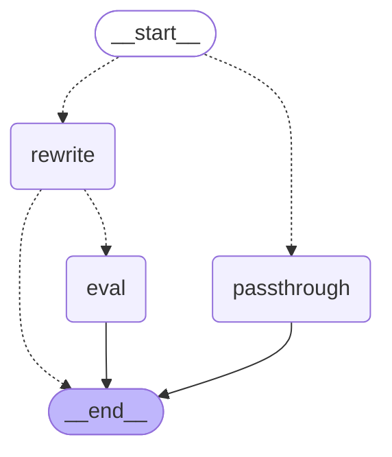
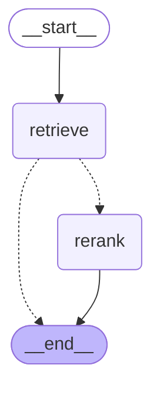
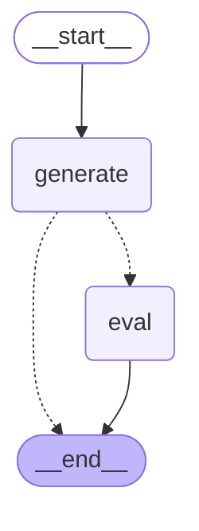
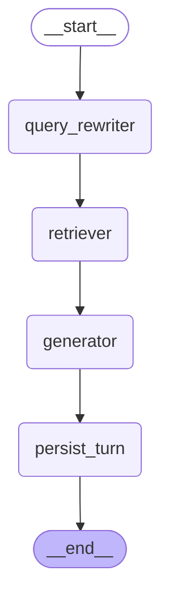
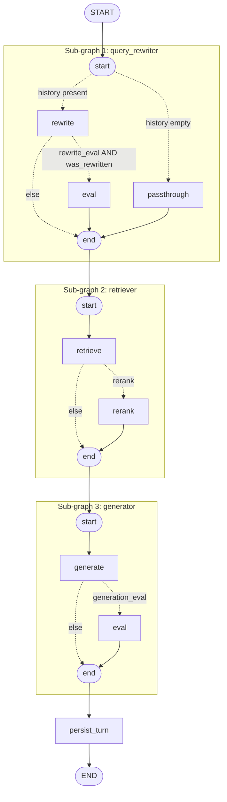

# LangGraph RAG — Query Rewriting, Retrieval + Reranking, Generation + Eval

> 🧪 **Try it hands-on:** [`jupyter/08-rag.ipynb`](jupyter/08-rag.ipynb) — build this concept from scratch, cell by cell, with a Playground section to experiment in.

## Concept

`langchain_demo/rag_demo.py` demonstrates RAG as a straight-line pipeline:
retrieve top-k chunks, stuff them into a prompt, ask the LLM. This concept
demonstrates the same idea decomposed into three independently-compiled
**sub-graphs**, stitched together by one parent graph — the LangGraph
equivalent of `07-multi-agent.md`'s specialist pattern, but applied to
pipeline *stages* instead of alternative *agents*:

1. **`query_rewriter`** — rewrites the current question into a standalone
   query, using prior conversation turns.
2. **`retriever`** — fetches the top-k chunks for that query from a vector
   store, optionally reranks them down to the top-n with Cohere.
3. **`generator`** — answers the (rewritten) question using the retrieved
   chunks as context, optionally evaluates the answer with Cohere.

Each sub-graph lives in its own file under `langgraph_demo/rag/sub_graphs/`,
is compiled once at module load as a singleton, and has its own narrow
`TypedDict` state — no shared "god state" across sub-graphs. The parent
graph (`langgraph_demo/rag/graph.py`) doesn't know how any sub-graph works
internally; it only knows how to translate its own `RagState` into each
sub-graph's input shape and merge the result back.

## Why a query rewriter at all

Say a user asks "What is the capital of India?", the app answers "Delhi",
and the user's next question is "Where is it located?". Searched literally,
"it" matches nothing useful in a vector store — the store has no idea "it"
means Delhi. The query rewriter's job is exactly this: given the current
question plus the conversation so far, produce a standalone version of the
question ("Where is Delhi located?") that a similarity search can actually
use.

If there's no prior conversation, there's nothing to resolve — the rewrite
step is a pass-through (`rewritten_query == question`). **Whether to rewrite
is a plain Python conditional edge on "is `history` non-empty", not an LLM
judgment call** — cheaper and deterministic, and it means the pass-through
case costs zero extra LLM calls.

## Sub-graph 1: `query_rewriter`

File: `langgraph_demo/rag/sub_graphs/query_rewriter.py`. State:
`QueryRewriterState` (`state.py`) — `question`, `history`, `model`,
`rewrite_eval` in; `rewritten_query`, `was_rewritten`,
`rewrite_eval_result` out.

```
START --[history empty]--> passthrough --> END
      --[history present]--> rewrite --[rewrite_eval AND was_rewritten]--> eval --> END
                                     --[else]--------------------------------------> END
```

- `passthrough` — `rewritten_query = question`, `was_rewritten = False`.
- `rewrite` — one LLM call, given the formatted history and the question,
  asked to resolve references and return a standalone question.
- `eval` — **only reachable when `rewrite_eval=True` AND a rewrite actually
  happened.** Evaluating a pass-through against itself is meaningless, so
  this runs conditionally on both, not on the flag alone. Asks Cohere
  (`command-r-08-2024`, via `cohere_client.judge`) to score the rewrite's
  faithfulness to the original question's intent.

## Sub-graph 2: `retriever`

File: `langgraph_demo/rag/sub_graphs/retriever.py`. State: `RetrieverState`
— `query`, `vector_backend`, `top_k`, `top_n`, `rerank` in; `documents`,
`reranked` out.

```
START --> retrieve --[rerank]--> rerank --> END
                    --[else]-----------------> END
```

- `retrieve` — fetches the top-`top_k` chunks for `query` via
  `vector_stores.retrieve_documents()` (async — see Gotchas).
- `rerank` — **only reachable when `rerank=True`.** Cross-encoder reranking
  (Cohere `rerank-v3.5`) is more accurate than embedding similarity alone,
  but too slow to run over a whole corpus — hence "narrow with embeddings
  first (`top_k`), then rerank the shortlist down to the most relevant
  `top_n`."

## Sub-graph 3: `generator`

File: `langgraph_demo/rag/sub_graphs/generator.py`. State: `GeneratorState`
— `query`, `documents`, `model`, `generation_eval` in; `answer`,
`generation_eval_result` out.

```
START --> generate --[generation_eval]--> eval --> END
                   --[else]--------------------------> END
```

- `generate` — the actual RAG answer: stuff `documents` into a prompt as
  context, ask the LLM to answer `query` using only that context.
- `eval` — **only reachable when `generation_eval=True`.** Asks Cohere to
  score the answer's groundedness (supported by context, not hallucinated),
  relevance (addresses the question), and completeness (fully answers it) —
  each 0.0–1.0.

## The three flags are independent

`rewrite_eval`, `rerank`, and `generation_eval` are three separate boolean
**query parameters**, each defaulting to `False`. Turning one on has no
effect on the others — e.g. `?rerank=true` alone runs reranking but no
rewrite eval and no generation eval. With all three at their default
(`False`), no Cohere call happens anywhere in the pipeline and no
`COHERE_API_KEY` is required at all.

## Parent graph: `graph.py`

```
START -> query_rewriter -> retriever -> generator -> persist_turn -> END
```

Four wrapper nodes, each translating a slice of `RagState` into a
sub-graph's input and merging its output back:

```python
def _run_query_rewriter(state: RagState) -> dict:
    history = get_turns(state["session_id"], HistoryBackend(state["history_backend"]))
    result = query_rewriter_graph.invoke({"question": state["question"], "history": history, ...})
    return {"rewritten_query": result["rewritten_query"], ...}
```

The sub-graphs are **not** embedded directly as parent nodes the way
`multi_agent.py`'s specialists are (LangGraph does support that when state
schemas are compatible) — here they aren't compatible: `RagState` carries
fields no single sub-graph needs (`session_id`, `history_backend`, ...),
and each sub-graph carries fields `RagState` doesn't (e.g.
`QueryRewriterState.history`). Thin wrapper nodes are the honest fit.

`persist_turn` records the question/answer pair to `history_backend` after
generation completes, so the *next* call on the same `session_id` sees this
turn.

## Diagram 1 — each sub-graph, individually

Generated from the real compiled graphs via `<graph>.get_graph().draw_mermaid()`.


*`query_rewriter` sub-graph*


*`retriever` sub-graph*


*`generator` sub-graph*

## Diagram 2 — the parent graph, sub-graphs as single nodes

Also generated directly from `rag_graph.get_graph().draw_mermaid()` — this
is the level at which `graph.py`'s wiring operates: each sub-graph is one
opaque node.



## Diagram 3 — parent graph and sub-graphs together

Hand-composed by expanding each Diagram-2 node back into its Diagram-1
internals (`mermaid` `subgraph` blocks), so the full pipeline — including
which conditional branches are flag-gated — is visible in one picture.



## Customizable backends

Two independent selectors, both **query parameters**, both defaulting to
`memory`:

| Selector | Values | Where it's implemented |
|---|---|---|
| `history_backend` | `memory` \| `redis` \| `postgres` | `langgraph_demo/rag/history_stores/` |
| `vector_backend` | `memory` \| `redis` \| `postgres` | `langgraph_demo/rag/vector_stores/` |

These are chosen and mixed independently — `?history_backend=redis&vector_backend=postgres`
is valid.

**Vector stores are reused wholesale.** `vector_stores/__init__.py` just
re-exports `VectorBackend`/`ingest`/`retrieve_documents` from
`langchain_demo.rag_demo` — the embedding-dimension probing, HNSW
indexing, and per-backend upsert quirks were already found and fixed
getting that file right (see `docs/langchain/07-rag/`); re-deriving them
here would only reintroduce the same bugs.

**History stores are asymmetric on purpose:**
- `memory` — a fresh, cheap closure (`history_stores/memory_store.py`);
  simple enough that writing it from scratch costs less than an import
  indirection.
- `redis`/`postgres` — thin delegates to
  `langchain_demo.memory_conversation_redis`/`memory_conversation_postgres`,
  reusing their already-debugged `overwrite_index` reindex-race fix and
  UUID session-id hashing, respectively. A session started via
  `/langchain/memory` and continued via `/langgraph/rag` on the same
  backend shares history — both read/write the same store.

## Local infra prerequisites

- `history_backend=memory` and `vector_backend=memory` (the defaults):
  none.
- `redis`/`postgres` for either selector: `scripts/start_infra.sh`.
- `rewrite_eval=true`, `rerank=true`, or `generation_eval=true` (any of
  them): `COHERE_API_KEY` set in `.env` (see that file's comment next to
  `COHERE_API_KEY` for how to get a trial key). Not needed at all with all
  three flags at their `False` default.

## How to call it

```bash
# First turn — no history yet, query rewriter is a pass-through.
curl -s -X POST "localhost:18282/langgraph/rag/demo-session" \
  -H 'Content-Type: application/json' -d '{"question": "What is RAG used for?"}'

# Second turn — "that" gets rewritten using turn 1's history.
curl -s -X POST "localhost:18282/langgraph/rag/demo-session" \
  -H 'Content-Type: application/json' -d '{"question": "Which backend is best for that?"}'

# All three eval/rerank flags on, redis history + postgres vectors (needs
# COHERE_API_KEY and scripts/start_infra.sh):
curl -s -X POST "localhost:18282/langgraph/rag/demo-session-2?history_backend=redis&vector_backend=postgres&rewrite_eval=true&rerank=true&generation_eval=true" \
  -H 'Content-Type: application/json' -d '{"question": "What is RAG used for?"}'
```

Also accepts `model` (`"llama3.2"` default or `"gemma4"`), `top_k`
(default `4`), and `top_n` (default `3`, only consulted when
`rerank=true`) as query parameters.

## Gotchas

- The `retriever` sub-graph's `retrieve` node is `async` (it calls
  `vector_stores.retrieve_documents()`, async to support the Postgres
  backend's async driver), so `retriever_graph` and the parent `rag_graph`
  are invoked with `.ainvoke()`, not `.invoke()`. Mixing sync node
  functions (the other three parent nodes) with one async node under
  `.ainvoke()` is fine — LangGraph runs sync nodes inline and awaits async
  ones.
- `rewrite_eval`/`rerank`/`generation_eval` each independently require
  `COHERE_API_KEY`; leaving it unset and setting any of them returns
  `400` with a message pointing at `.env`, not a `500`.
- The `eval` node inside `query_rewriter` is skipped even with
  `rewrite_eval=true` if there was no history to rewrite from — see "Why
  a query rewriter at all" above.
